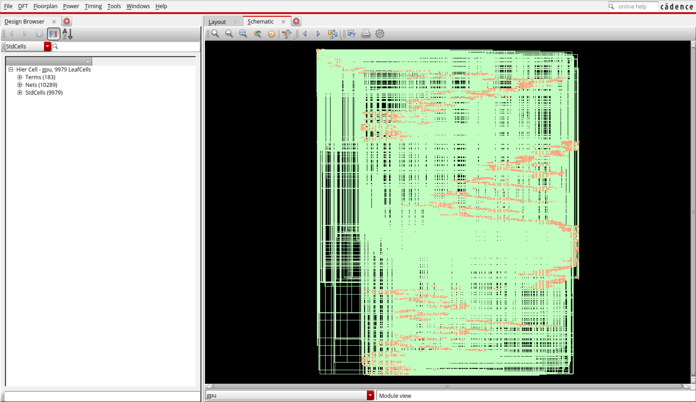
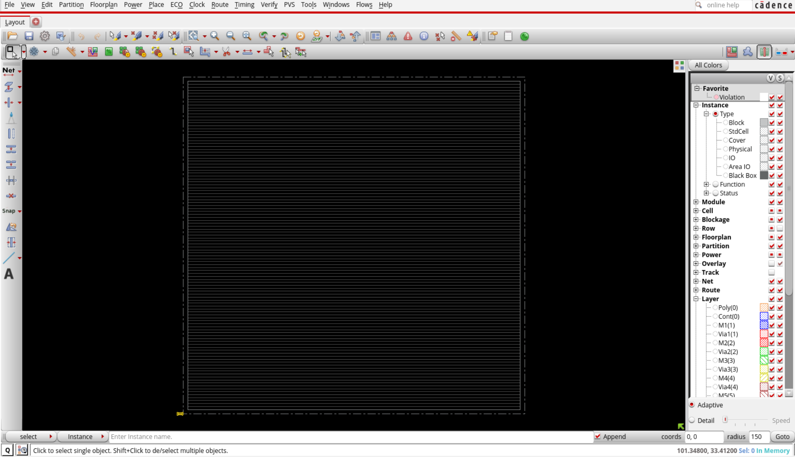
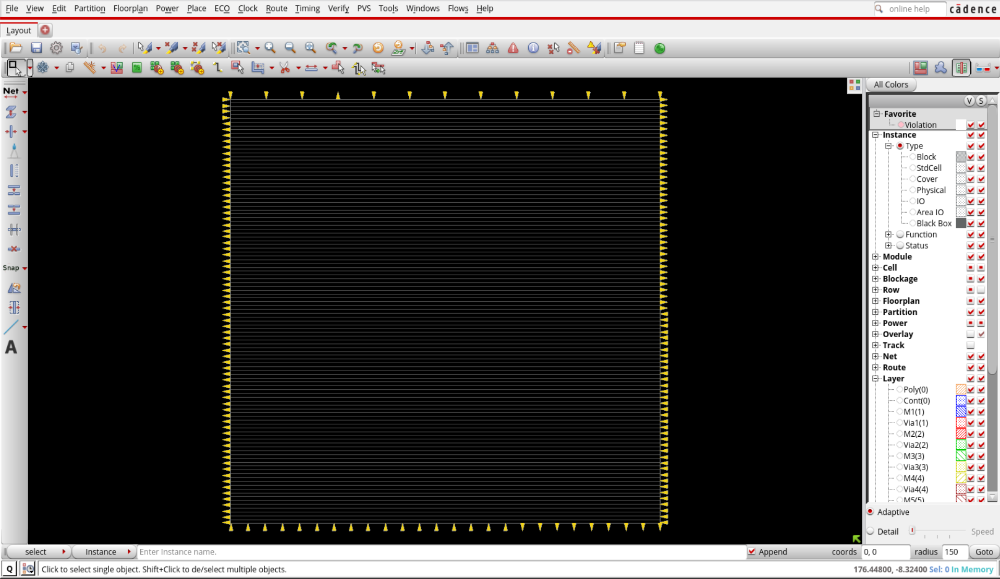
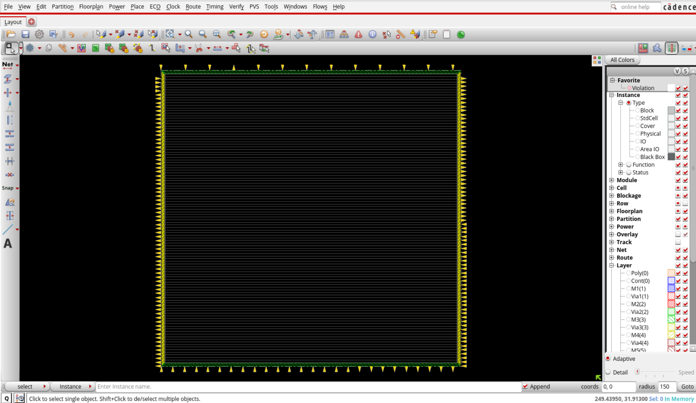
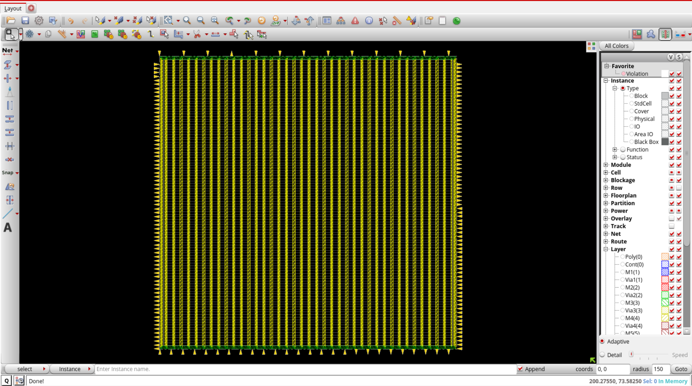
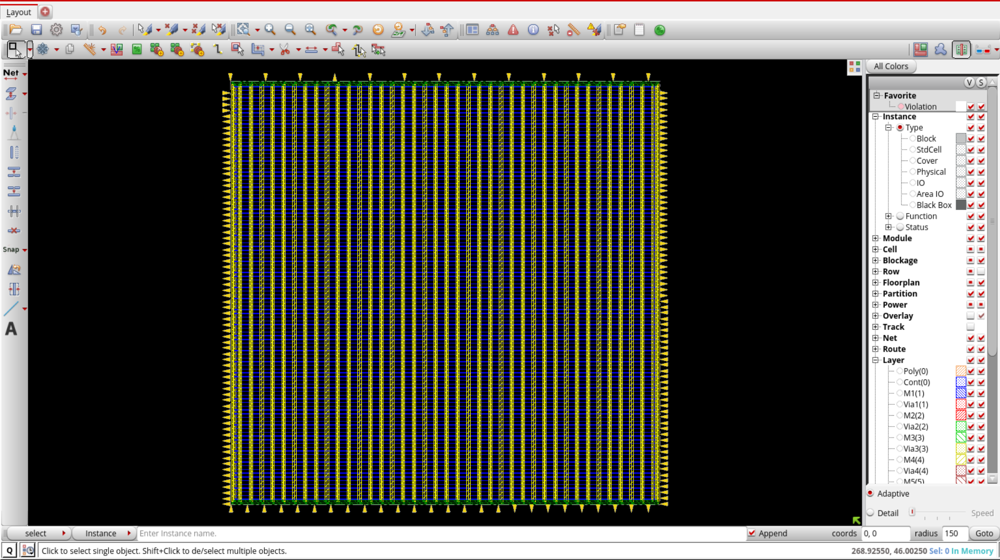
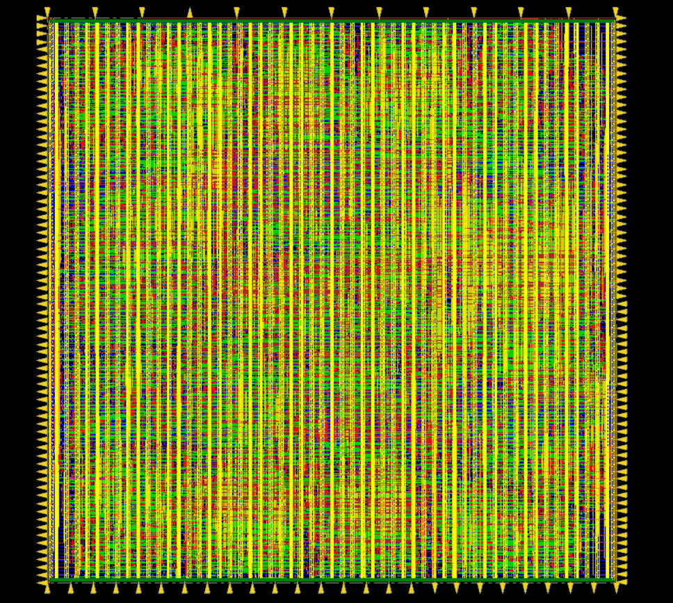
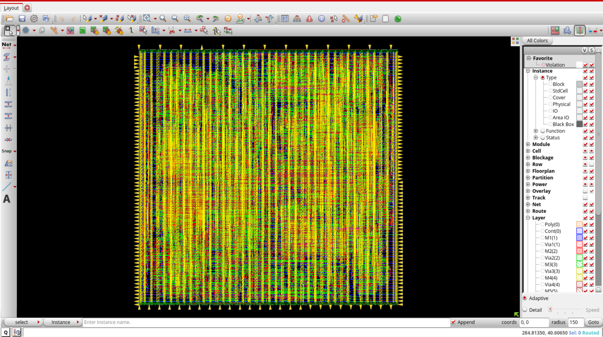
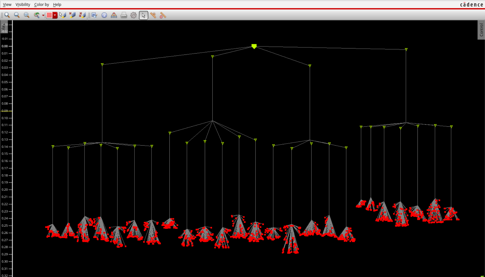
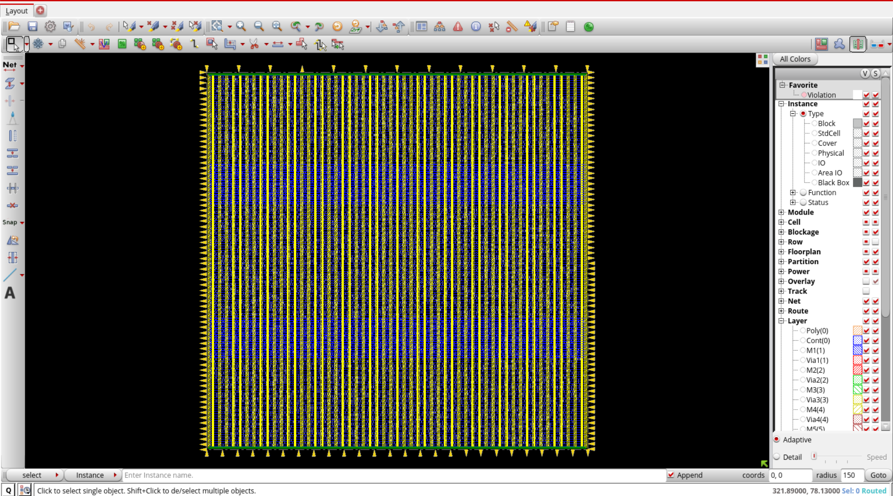

<div align="center">

# 🖥️ TinyGPU — RTL to GDSII Physical Design
### Full Backend Implementation on 45nm Technology Node


[]()
[]()
[]()
[]()
[]()

</div>

---

## 📌 Overview

This project implements a complete **RTL-to-GDSII physical design flow** for [TinyGPU](https://github.com/adam-maj/tiny-gpu) — a minimal GPU architecture written in SystemVerilog. The backend flow covers synthesis, floorplanning, pin placement, power planning, clock tree synthesis, placement, routing, and DRC verification using the **Cadence EDA toolchain** on a **45nm process node**.

---

## 🙏 Credits

> **Original RTL Design — TinyGPU**
> Designed by **Adam Maj** — [adam-maj/tiny-gpu](https://github.com/adam-maj/tiny-gpu)
> A minimal, fully synthesizable GPU written in SystemVerilog, designed to demonstrate how GPUs work at the hardware level.


---

## ⚙️ Design Specifications

| Parameter | Value |
|:---|:---|
| 🔬 Technology Node | 45nm  |
| 📦 Top Module | `gpu.sv` |
| 🛠️ Synthesis Tool | Cadence Genus |
| 🛠️ P&R Tool | Cadence Innovus 21.1 |
| ⏱️ Clock Period | 10ns @ 100 MHz |
| 📐 Core Utilization | 70% |
| 🔩 Metal Layers | 11 (M10/M11 reserved for power) |
| 🌲 CTS Skew | 73ps |
| 🔁 Flop Count | 1811 |
| 🔋 CTS Buffers | 29 (CLKBUFX12 / CLKBUFX16 / CLKBUFX20) |

---

## 🏗️ RTL Architecture

```
                        ┌─────────────────────┐
                        │       gpu.sv         │  ← Top Module
                        └────────┬────────────┘
              ┌─────────────────┼──────────────────┐
              │                 │                  │
      ┌───────┴──────┐  ┌───────┴──────┐  ┌───────┴──────┐
      │  dispatcher  │  │    core[0]   │  │    core[1]   │
      └──────────────┘  └──────┬───────┘  └──────┬───────┘
                               │                  │
              ┌────────────────┼──────────────────┘
              │                │
    ┌─────────┴──┐   ┌─────────┴──┐   ┌──────────┐   ┌──────────┐
    │  scheduler │   │   fetcher  │   │  decoder │   │   alu    │
    └────────────┘   └────────────┘   └──────────┘   └──────────┘
    ┌────────────┐   ┌────────────┐   ┌──────────┐   ┌──────────┐
    │    lsu     │   │     pc     │   │ reg_file │   │  cache   │
    └────────────┘   └────────────┘   └──────────┘   └──────────┘
                        ┌────────────────────┐
                        │  memory_controller │
                        └────────────────────┘
```

---

## 🔄 Complete Flow

```
 ┌─────────────────────────────────────────────┐
 │           SystemVerilog RTL Source          │
 └──────────────────┬──────────────────────────┘
                    │
                    ▼
 ┌─────────────────────────────────────────────┐
 │         Cadence Genus — Synthesis           │
 │   • Read RTL + Libraries                    │
 │   • Set constraints (clock, IO delays)      │
 │   • Generate mapped netlist + SDC           │
 └──────────────────┬──────────────────────────┘
                    │
                    ▼
 ┌─────────────────────────────────────────────┐
 │       Cadence Innovus — Floorplan           │
 │   • Aspect ratio 1.0, utilization 70%       │
 │   • 20um core margins all sides             │
 └──────────────────┬──────────────────────────┘
                    │
                    ▼
 ┌─────────────────────────────────────────────┐
 │            Pin Planning                     │
 │   • N: clk, reset, control signals (M6)     │
 │   • S: program memory ports (M6)            │
 │   • E: data memory read (M5)                │
 │   • W: data memory write (M5)               │
 └──────────────────┬──────────────────────────┘
                    │
                    ▼
 ┌─────────────────────────────────────────────┐
 │           Power Planning                    │
 │   • Rings  → M10 (H) / M11 (V)              │
 │   • Stripes → M9 horizontal                 │
 │   • sroute → connect VDD/VSS to cell pins   │
 └──────────────────┬──────────────────────────┘
                    │
                    ▼
 ┌─────────────────────────────────────────────┐
 │              Placement                      │
 │   • place_design                            │
 │   • Placement density: 42.58%               │
 └──────────────────┬──────────────────────────┘
                    │
                    ▼
 ┌─────────────────────────────────────────────┐
 │       Clock Tree Synthesis (CTS)            │
 │   • ccopt_design                            │
 │   • 29 buffers, 2-level tree                │
 │   • Skew: 73ps ✅                           │
 └──────────────────┬──────────────────────────┘
                    │
                    ▼
 ┌─────────────────────────────────────────────┐
 │              Routing                        │
 │   • routeDesign (NanoRoute)                 │
 │   • Bottom layer: M2 (signals skip M1)      │
 └──────────────────┬──────────────────────────┘
                    │
                    ▼
 ┌─────────────────────────────────────────────┐
 │           DRC / Verification                │
 │   • verify_drc                              │
 │   • verifyConnectivity                      │
 └─────────────────────────────────────────────┘
```

---

## 📸 Design Outputs

### 🔷 Synthesis
> Genus synthesis — mapped netlist generated from SystemVerilog RTL with timing constraints applied.



---

### 🔷 Floorplan
> Die floorplan with 70% core utilization, 1:1 aspect ratio, and 20um margins.



---

### 🔷 Pin Planning
> Top-level I/O pins distributed across all four sides on M5/M6 routing layers.



---

### 🔷 Power Rings
> VDD/VSS power rings added on M10 (horizontal) and M11 (vertical).



---

### 🔷 Power Stripes
> Horizontal power stripes on M9 distributing VDD/VSS across the core.



---

### 🔷 SRoute — Power Rail Connections
> `sroute` connecting power grid to standard cell VDD/VSS pins via M1/M2.



---

### 🔷 Placement
> Standard cell placement after `place_design` — 10133 cells placed, 0 unplaced.




---

### 🔷 Clock Tree Synthesis
> `ccopt_design` result — 29 clock buffers inserted, 1811 flop sinks reached, skew 73ps.



---

### 🔷 Final Routed Layout
> Post-route layout after `routeDesign` with NanoRoute.



---

## 🌲 CTS Report Summary

```
╔══════════════════════════════════════════════════╗
║           Clock Tree Summary — clk               ║
╠══════════════════════════════════════════════════╣
║  Buffers Inserted     :  29                      ║
║  Tree Depth           :  2 levels                ║
║  Max Fanout (leaf)    :  90                      ║
║  Avg Fanout (leaf)    :  72.44                   ║
║  Max Source-Sink Len  :  331.87 um               ║
║  Clock Skew           :  73ps  ✅ (target 81ps)  ║
║  Flop Sinks           :  1811 (all posedge)      ║
║  Buffer Cells Used    :  CLKBUFX12/16/20         ║
╚══════════════════════════════════════════════════╝
```

---

## 🛠️ Tools & PDK

| Tool | Version | Purpose |
|:---|:---|:---|
| Cadence Genus | — | RTL Synthesis |
| Cadence Innovus | 21.1 | Floorplan, P&R, CTS |
| gsclib090 PDK | 45nm | Standard Cell Library |
| JasperGold | — | Lint / CDC |
| sv2v | — | SV → Verilog conversion |

---

## 📚 Key Learnings

- End-to-end RTL-to-GDSII flow on a real GPU design
- Technology LEF debugging — layer ordering, via definitions, parser errors
- Power planning sequencing and its critical impact on routing
- CTS buffer selection, slew/skew tradeoffs and violation fixing
- DRC debug methodology in Innovus 21.1
- SDC multi-corner analysis view setup
- Hands-on experience with real Cadence tool errors and fixes

---

## 📁 Repository Structure

```
tinygpu-rtl-to-gdsii/
├── rtl/                  # SystemVerilog source files
├── lib/                  # Liberty timing libraries (.lib)
├── lef/                  # Technology and cell LEF files
├── sdc/                  # Timing constraints (SDC)
├── scripts/
│   ├── genus_synth.tcl   # Synthesis script
│   ├── innovus_flow.tcl  # Full PD flow script
│   └── ccopt.spec        # CTS specification
├── outputs/              # Screenshots of each flow stage
└── README.md
```

---

## 🔗 References

- [TinyGPU by Adam Maj](https://github.com/adam-maj/tiny-gpu) — Original RTL
- [Cadence Innovus Documentation](https://www.cadence.com)
- [gsclib090 45nm Standard Cell Library]

---

## 📄 License

- RTL source: refer to [TinyGPU original license](https://github.com/adam-maj/tiny-gpu/blob/main/LICENSE)


---

<div align="center">
"Tape-out ready starts with getting the basics right."
</div>
